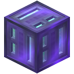

# Buffers

## Item Buffer

**The Item Buffer is a block with a 9 stack inventory that can push/pull like a hopper in any direction.**

*Redstone Mode and Side IO can be configured.*

## Power Buffer

**The Power Buffer is a block that holds and transfers power.**

*The Max Input and Max Output values can be configured in the GUI.*

*Redstone Mode and Side IO can be configured.*

**Requires a [[Capacitor|Capacitors]] to function.**

*Higher Level Capacitors increase Buffer Size and Maximum Transfer Rate.*

| Capacitor Level               | Max In/Out (µI/t) | Buffer (µI) |
| :---------------------------- | ----------------: | ----------: |
| 1 (e.g. Basic)                |             2,500 |     100,000 |
| 2 (e.g. Double-Layer)         |             7,500 |     300,000 |
| 3 (e.g. Octadic)              |            22,500 |     500,000 |
| 4 (e.g. Melodic)              |            67,500 |     800,000 |
| 5 (e.g. Stellar)              |           202,500 |   1,300,000 |
| 6 (e.g. Efficiency V Totemic) |           607,500 |   1,800,000 |

## Omni Buffer

**The Omni Buffer is a block that combines the functionalities of the [Item Buffer](#item-buffer) and of the [Power Buffer](#power-buffer) into a single block.**

## Creative Buffer

**A creative version of the [Omni Buffer](#omni-buffer).**

It is permanently set to contain 250,000 µI out of 500,000 and is capable of transferring up to 100,000 µI.

Energy can either be inserted (voided) or extracted (infinite supply).

It doesn't accept [[Capacitors]].