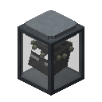

# Ender Generator

### *Best Power Generation Method in EnderIO*

**Generates power from [[Dew of the Void|Fluids#dew-of-the-void]].**

*For this machine to work, you **have to** insert a [[Capacitor|Capacitors]].*

*Requires at least 1,400 mB to generate power* and has a buffer of 2,000 mB.

The Ender Generator runs at a constant rate of 96 t/mB.

Higher level capacitors increase the energy production rate (µI/t).

| Capacitor Level              | µI/t |
| :--------------------------- | ---: |
| 1 (e.g. Basic)                |  360 |
| 2 (e.g. Double-Layer)         |  450 |
| 3 (e.g. Octadic)              |  540 |
| 4 (e.g. Melodic)              |  630 |
| 5 (e.g. Stellar)              |  720 |
| 6 (e.g. Efficiency V Totemic) |  810 |