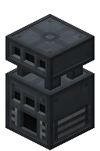
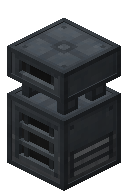
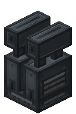
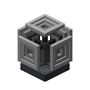

# Enhanced Machines

*Enhanced Machines are better versions of Ender IO's most important machines.*

***They are the highest tier.***

They are more expensive, but are faster and hold more energy.

**They ocupy a space of 2 blocks, but the upper part doesn't have side configuration, doesn't respond to redstone signal, and can't be used to extract/insert items or energy.**

*Enhanced machines **require** a [[Capacitor|Capacitors]] to work.*

Higher level capacitors increase the speed and the energy buffer.

## Enhanced Combustion Generator

Enhanced version of the [[Combustion Generator]].

## Enhanced Alloy Smelter

Enhanced version of the [[Alloy Smelter]].

## Enhanced Sag Mill

Enhanced version of the [[SAG Mill].

## The Enhanced Vat

Enhanced version of [[The Vat]].

## Enhanced Wired Charger

Enhanced version of the [[Wired Charger]].

## Enhanced Wireless Charging Antenna

Enhanced version of the [[Wireless Charging Antenna]].

**Unlike the other Enhanced Machines, it occupies a space of only 1 block.**